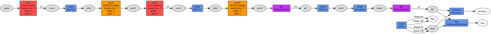

<!--

Licensed to the Apache Software Foundation (ASF) under one or more
contributor license agreements.  See the NOTICE file distributed with
this work for additional information regarding copyright ownership.
The ASF licenses this file to you under the Apache License, Version 2.0
(the "License"); you may not use this file except in compliance with
the License.  You may obtain a copy of the License at

http://www.apache.org/licenses/LICENSE-2.0

Unless required by applicable law or agreed to in writing, software
distributed under the License is distributed on an "AS IS" BASIS,
WITHOUT WARRANTIES OR CONDITIONS OF ANY KIND, either express or implied.
See the License for the specific language governing permissions and
limitations under the License.

-->

# Dataset

The MNIST dataset was constructed from two datasets of the US National Institute of Standards and Technology (NIST). The training set consists of handwritten digits from 250 different people, 50 percent high school students, and 50 percent employees from the Census Bureau. Note that the test set contains handwritten digits from different people following the same split.

In the below example, we are using `mlxtend` package to load the mnist dataset into Python NumPy arrays, but you are free to download it directly from http://yann.lecun.com/exdb/mnist/.

# Networks

## LeNet

Lenet is a simple convolutional neural network, proposed by Yann LeCun in 1998. It has 2 convolutions/pooling and fully connected layer. Similar to Caffe, the network has been modified to add dropout. For more detail, please see http://yann.lecun.com/exdb/lenet/



# Example

  1. Install mlextend: `pip install mlxtend`
  2. Download nn library and SystemML.jar  in the current directory. (This step will not be required when PR is merged and you install SystemML through pip)
  3. Invoke pyspark shell: `pyspark --master local[*] --driver-class-path SystemML.jar`

## Training using Caffe models on Lenet

The below script also demonstrates how to save the trained model.

```python
# Download the MNIST dataset
from mlxtend.data import mnist_data
import numpy as np
from sklearn.utils import shuffle
X, y = mnist_data()
X, y = shuffle(X, y)
num_classes = np.unique(y).shape[0]
img_shape = (1, 28, 28)

# Split the data into training and test
n_samples = len(X)
X_train = X[:int(.9 * n_samples)]
y_train = y[:int(.9 * n_samples)]
X_test = X[int(.9 * n_samples):]
y_test = y[int(.9 * n_samples):]

# Download the Lenet network
import urllib
urllib.urlretrieve('https://raw.githubusercontent.com/niketanpansare/model_zoo/master/caffe/vision/lenet/mnist/lenet.proto', 'lenet.proto')
urllib.urlretrieve('https://raw.githubusercontent.com/niketanpansare/model_zoo/master/caffe/vision/lenet/mnist/lenet_solver.proto', 'lenet_solver.proto')

# Train Lenet On MNIST using scikit-learn like API
from systemml.mllearn import Caffe2DML
lenet = Caffe2DML(sqlCtx, solver='lenet_solver.proto').set(max_iter=500, debug=True).setStatistics(True)
print('Lenet score: %f' % lenet.fit(X_train, y_train).score(X_test, y_test))

# Save the trained model
lenet.save('lenet_model')
```

## Load the trained model and retrain (i.e. finetuning)

```python
# Fine-tune the existing trained model
new_lenet = Caffe2DML(sqlCtx, solver='lenet_solver.proto', weights='lenet_model').set(max_iter=500, debug=True)
new_lenet.fit(X_train, y_train)
new_lenet.save('lenet_model')
```

## Perform prediction using the above trained model

```python
# Use the new model for prediction
predict_lenet = Caffe2DML(sqlCtx, solver='lenet_solver.proto', weights='lenet_model')
print('Lenet score: %f' % predict_lenet.score(X_test, y_test))
```

# References

  1. Y. LeCun and C. Cortes. Mnist handwritten digit database. AT&T Labs [Online]. Available: http://yann.lecun.com/exdb/mnist, 2010.
  2. http://yann.lecun.com/exdb/lenet/
  3. https://github.com/BVLC/caffe/tree/master/examples/mnist
  4. http://rasbt.github.io/mlxtend/user_guide/data/mnist_data/
